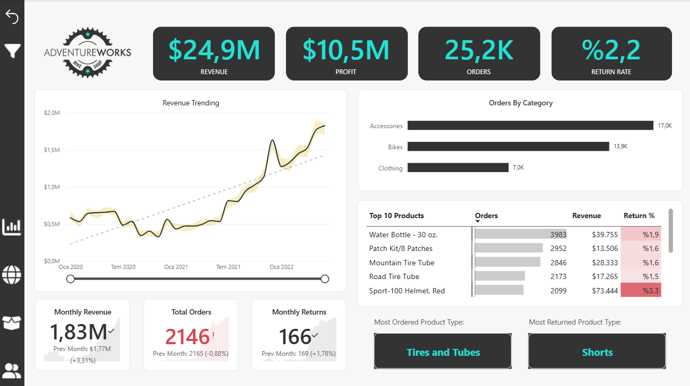
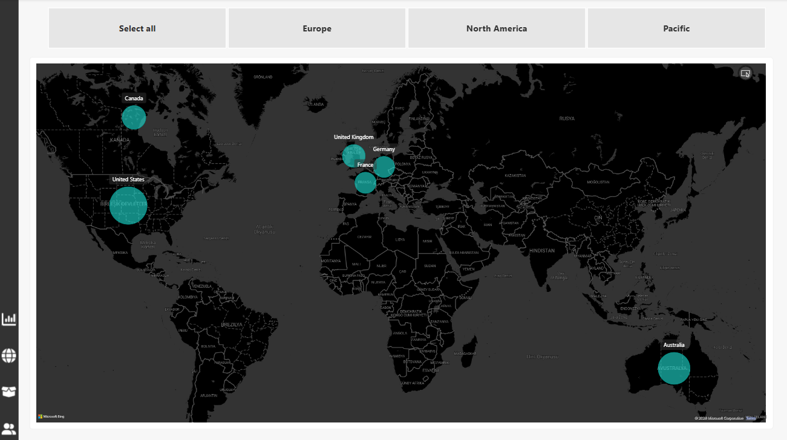
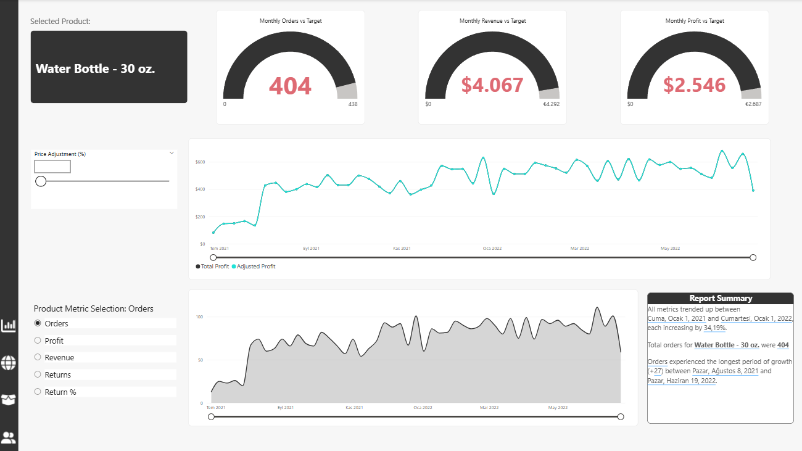
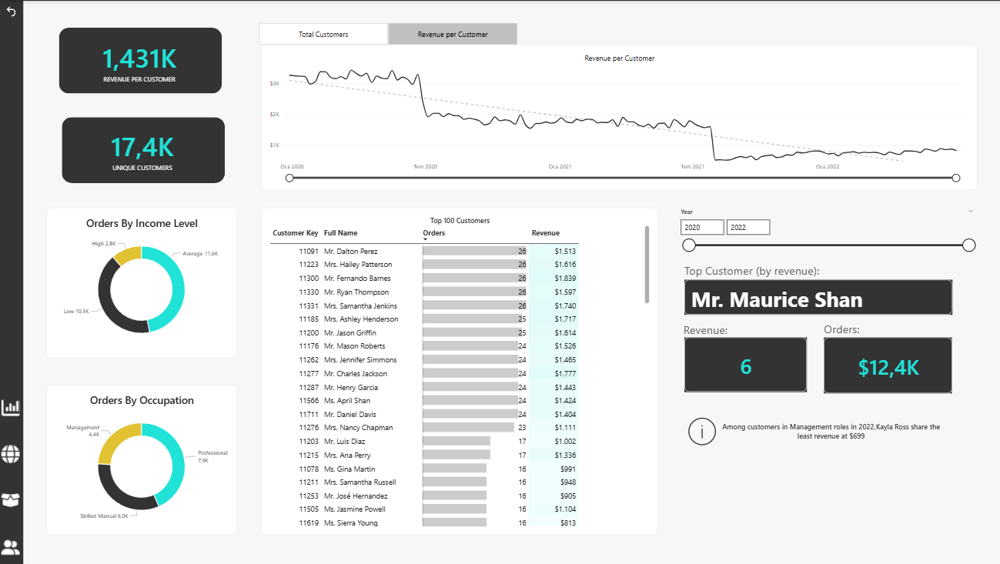
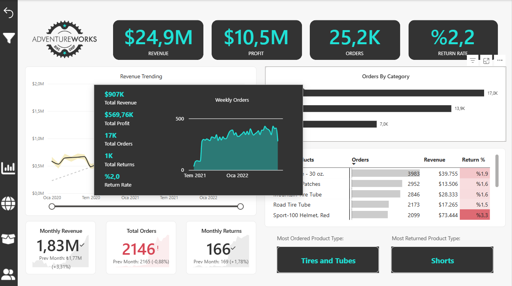

bash
[🇹🇷 Türkçe Dokümantasyon İçin Tıklayın](README_TR.md)

---
# Adventure Works Business Intelligence Report

An end-to-end Power BI cloud analytics project designed to transform raw operational, sales, and customer data into a streamlined, interactive dashboard for leadership reviews.

## 📊 Dashboard Previews
*Here are the clean, clutter-free views designed for non-technical stakeholders to capture performance trends instantly:*

---

## 🎯 Project Overview & Objectives
The primary focus of this project was to eliminate data friction for management teams. Instead of analyzing disjointed spreadsheets, this solution centralizes multi-table operational data into a single source of truth, emphasizing simplicity and practical decision-making.

## 🛠️ Tech Stack & Key Features
- **Data Modeling:** Transformed raw tables into a clean star-schema data model using Power Query.
- **DAX Analytics:** Developed dynamic calculations to monitor performance trends, sales cycles, and operational metrics.
- **UI/UX Design:** Focused on a minimalist, quiet design pattern to make reports easy to read during executive meetings.
- **Data Integrity:** Cleaned missing values and handled inconsistent categories to ensure robust factual reporting.
